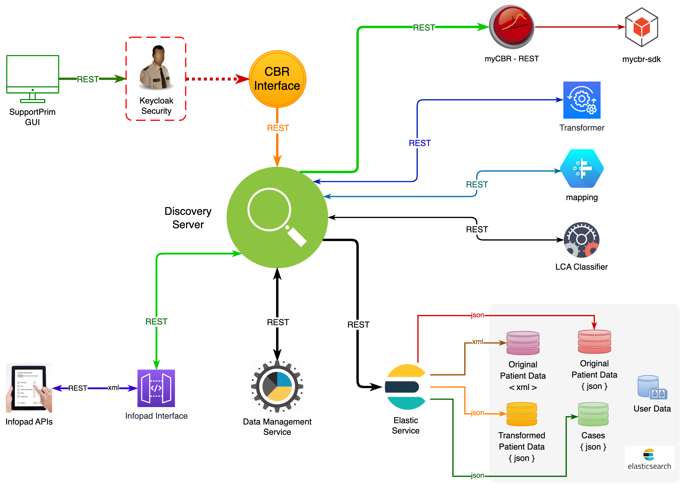

# SupportPrim CDSS Backend Architecture
Welcome to the repository for **SupportPrim CDSS** (Clinical Decision Support System), **solely developed by Amar Jaiswal** as part of his PhD research:
> *Leveraging Knowledge and Data-Driven Approaches in Case-Based Reasoning to Aid Physiotherapists Addressing Non-Specific Musculoskeletal Disorders*
---
## 1. Introduction
**SupportPrim CDSS** assists physiotherapists in making informed decisions for **non-specific musculoskeletal disorders (MSDs)**. It uses **Case-Based Reasoning (CBR)**, integrating both **knowledge-driven** (expert rules) and **data-driven** (machine learning) approaches to match patient data with previously successful treatments. This approach streamlines clinical workflows, supports evidence-based practice, and offers **personalized treatment recommendations**.
---
## 2. Key Features
1. **Hybrid Case Retrieval**  
   - Merges data-driven machine learning techniques with expert-encoded rules.
2. **Adaptive Learning**  
   - Updates its recommendation engine with outcomes from newly treated cases.
3. **Comprehensive CBR Workflow**  
   - Follows the Retrieve, Reuse, Revise, Retain cycle for tailored recommendations.
4. **Interoperable Microservices**  
   - RESTful APIs ensure easy integration with **Electronic Health Records (EHRs)** and third-party systems.
5. **Scalable Design**  
   - Supports distributed deployments and manages large volumes of patient data.
---
## 3. Deployment Structure
```plaintext
supportprim-cdss/
├── README.md
├── jars/
│   ├── cbr-interface/
│   │   ├── application.properties
│   │   └── cbr-interface-0.1-SNAPSHOT.jar
│   ├── data-management-0.1-SNAPSHOT.jar
│   ├── discovery-server-0.1-SNAPSHOT.jar
│   ├── elastic-interface-0.1-SNAPSHOT.jar
│   ├── infopad-interface-0.1-SNAPSHOT.jar
│   ├── lca-calculator-0.1-SNAPSHOT.jar
│   ├── mapping-0.1-SNAPSHOT.jar
│   ├── myCBR-3.3-SNAPSHOT.jar
│   ├── mycbr-rest-2.0.jar
│   └── transformer-0.1-SNAPSHOT.jar
├── mycbr-projects/
│   └── supportprim_cbr_latest.prj
├── resources/
│   └── infopad_to_ism_transformer.xslt
├── start-backend.sh
├── stop-backend.sh
└── ...
```
- jars/: Java-based services and dependencies.
- mycbr-projects/: Files for the myCBR engine.
- resources/: Configuration or transformation files.
- start-backend.sh, stop-backend.sh: Scripts to start and stop microservices.
## 4. Architecture Overview
1. **Discovery Server**  
    - Registers and discovers available microservices.
2. **CBR Interface**
    - Connects to the myCBR engine for case retrieval and adaptation.
3. **Data Management Module**
    - Ingests and stores patient data from various sources.
4. **Infopad Interface**
    - Transforms and integrates external healthcare data (e.g., Infopad APIs).
5. **Transformer & Mapping**
    - Ensures consistency in data formats (XML, JSON, etc.).
6. **Elastic Interface (Optional)**
    - Supports advanced search and analytics with Elasticsearch.
7. **UI Integration**
    - A front-end (not included in this repo) calls these services via REST.

For a visual representation, see the supportprim-backend-subsystems_v3.pdf included in this repository.



## 5. Deployment Scripts
  - start-backend.sh : 
  Launches microservices in the required sequence.
  - stop-backend.sh : 
  Gracefully halts all running services.
## 6. License
This software is made available “as is,” one must seek permission from SupportPrim pincipal investigator (PI) Ingebrigt Meisingset having email-id as  ingebrigt.meisingset@ntnu.no. 
Users must recognize the intellectual efforts of Amar Jaiswal and the academic goals of his PhD research when employing or modifying this code.

